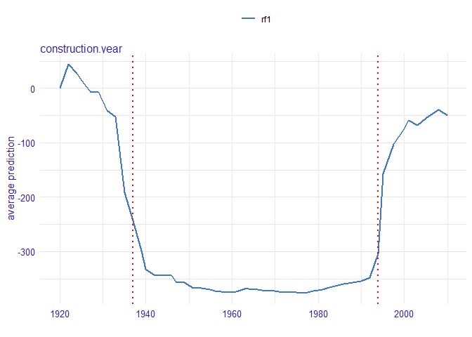
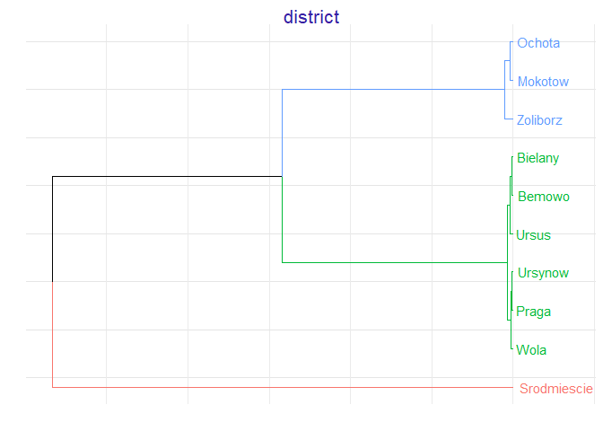
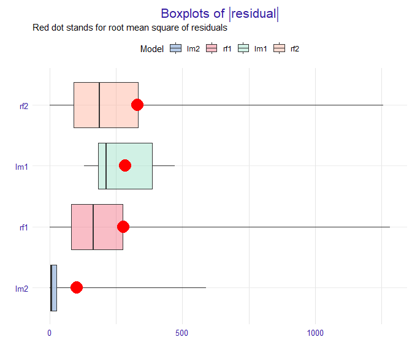

SAFE - Surrogate Assisted Feature Extraction
============================================

[](https://travis-ci.org/MI2DataLab/SAFE) [](https://codecov.io/gh/MI2DataLab/SAFE)

The `SAFE` package is a model agnostic tool for making an interpretable white-box model more accurate using alternative black-box model called surrogate model. Based on the complicated model, such as neural network or random forest, new features are being extracted and then used in the process of fitting a simpler interpretable model, improving its overall performance.

Getting started
---------------

The package can be installed from GitHub using the code below:

``` r
install.packages("devtools")
devtools::install_github("MI2DataLab/SAFE")
```

Demo
----

In this vignette we present an example of an application of the `SAFE` package in case of regression problems. It is based on `apartments` and `apartmentsTest` datasets which come from the `DALEX` package but are also available in the `SAFE` package. We will use these artificial datasets to predict the price per square meter of an apartment based on features such as construction year, surface, floor, number of rooms and district. It should be mentioned that four of these variables are continuous while the fifth one is categorical one.

``` r
library(SAFE)
head(apartments)
#>   m2.price construction.year surface floor no.rooms    district
#> 1     5897              1953      25     3        1 Srodmiescie
#> 2     1818              1992     143     9        5     Bielany
#> 3     3643              1937      56     1        2       Praga
#> 4     3517              1995      93     7        3      Ochota
#> 5     3013              1992     144     6        5     Mokotow
#> 6     5795              1926      61     6        2 Srodmiescie
```

Building a black-box model
--------------------------

First we fit a random forest model to the original `apartments` dataset - this is our complex model that will serve us as a surrogate.

``` r
library(randomForest)
set.seed(111)
model_rf1 <- randomForest(m2.price ~ construction.year + surface + floor + no.rooms + district, data = apartments)
```

Creating an explainer
---------------------

We also create an `explainer` object that will be used later to create new variables and at the end to compare models performance.

``` r
library(DALEX)
explainer_rf1 <- explain(model_rf1, data = apartmentsTest[1:3000,2:6], y = apartmentsTest[1:3000,1], label = "rf1")
explainer_rf1
#> Model label:  rf1 
#> Model class:  randomForest.formula,randomForest 
#> Data head  :
#>      construction.year surface floor no.rooms    district
#> 1001              1976     131     3        5 Srodmiescie
#> 1002              1978     112     9        4     Mokotow
```

Creating a safe\_extractor
--------------------------

Now, we create a `safe_extractor` object using `SAFE` package and our surrogate model. Setting the argument `verbose=FALSE` stops progress bar from printing.

``` r
safe_extractor <- safe_extraction(explainer_rf1, collapse = "_", verbose = FALSE)
```

Now, let's print summary for the new object we have just created.

``` r
print(safe_extractor)
#> Variable 'construction.year' - selected intervals:
#>  (-Inf, 1926]
#>      (1926, 1936.82]
#>      (1936.82, 1952]
#>      (1952, 1971]
#>      (1971, 1978]
#>      (1978, 1994]
#>      (1994, Inf)
#> Variable 'surface' - selected intervals:
#>  (-Inf, 28]
#>      (28, 44]
#>      (44, 72]
#>      (72, 101]
#>      (101, 129]
#>      (129, Inf)
#> Variable 'floor' - selected intervals:
#>  (-Inf, 4]
#>      (4, Inf)
#> Variable 'no.rooms' - selected intervals:
#>  (-Inf, 3]
#>      (3, Inf)
#> Variable 'district' - created levels:
#>  Bemowo, Bielany, Ursus, Ursynow, Praga, Wola ->  Bemowo_Bielany_Praga_Ursus_Ursynow_Wola 
#>  Zoliborz, Mokotow, Ochota ->  Mokotow_Ochota_Zoliborz 
#>  Srodmiescie ->  Srodmiescie
```

We can see transormation propositions for all variables in our dataset.

In the plot below we can see which points have been chosen to be the breakpoints for a particular variable:

``` r
plot(safe_extractor, variable = "construction.year")
```



For factor variables we can observe in which order levels have been merged and what is the optimal clustering:

``` r
plot(safe_extractor, variable = "district")
```



Transforming data
-----------------

Now we can use our `safe_extractor` object to create new categorical features in the given dataset.

``` r
data1 <- safely_transform_data(safe_extractor, apartmentsTest[3001:6000,], verbose = FALSE)
```

| district    |  m2.price|  construction.year|  surface|  floor|  no.rooms| construction.year\_new | surface\_new | floor\_new | no.rooms\_new | district\_new                                |
|:------------|---------:|------------------:|--------:|------:|---------:|:-----------------------|:-------------|:-----------|:--------------|:---------------------------------------------|
| Bielany     |      3542|               1979|       21|      6|         1| (1978, 1994\]          | (-Inf, 28\]  | (4, Inf)   | (-Inf, 3\]    | Bemowo\_Bielany\_Praga\_Ursus\_Ursynow\_Wola |
| Srodmiescie |      5631|               1997|      107|      2|         4| (1994, Inf)            | (101, 129\]  | (-Inf, 4\] | (3, Inf)      | Srodmiescie                                  |
| Bielany     |      2989|               1994|       41|      9|         2| (1978, 1994\]          | (28, 44\]    | (4, Inf)   | (-Inf, 3\]    | Bemowo\_Bielany\_Praga\_Ursus\_Ursynow\_Wola |
| Ursynow     |      3822|               1968|       28|      2|         2| (1952, 1971\]          | (-Inf, 28\]  | (-Inf, 4\] | (-Inf, 3\]    | Bemowo\_Bielany\_Praga\_Ursus\_Ursynow\_Wola |
| Ursynow     |      2337|               1971|      146|      3|         6| (1952, 1971\]          | (129, Inf)   | (-Inf, 4\] | (3, Inf)      | Bemowo\_Bielany\_Praga\_Ursus\_Ursynow\_Wola |
| Ochota      |      3381|               1956|       97|      8|         3| (1952, 1971\]          | (72, 101\]   | (4, Inf)   | (-Inf, 3\]    | Mokotow\_Ochota\_Zoliborz                    |

We can also perform feature selection if we wish. For each original feature it keeps exactly one of their forms - original one or transformed one.

``` r
vars <- safely_select_variables(safe_extractor, data1, which_y = "m2.price", verbose = FALSE)
data1 <- data1[,c("m2.price", vars)]
print(vars)
#> [1] "surface"               "floor"                 "no.rooms"             
#> [4] "construction.year_new" "district_new"
```

It can be observed that for some features the original form was preffered and for others the transformed one.

Here are the first few rows for our data after feature selection:

|  m2.price|  surface|  floor|  no.rooms| construction.year\_new | district\_new                                |
|---------:|--------:|------:|---------:|:-----------------------|:---------------------------------------------|
|      3542|       21|      6|         1| (1978, 1994\]          | Bemowo\_Bielany\_Praga\_Ursus\_Ursynow\_Wola |
|      5631|      107|      2|         4| (1994, Inf)            | Srodmiescie                                  |
|      2989|       41|      9|         2| (1978, 1994\]          | Bemowo\_Bielany\_Praga\_Ursus\_Ursynow\_Wola |
|      3822|       28|      2|         2| (1952, 1971\]          | Bemowo\_Bielany\_Praga\_Ursus\_Ursynow\_Wola |
|      2337|      146|      3|         6| (1952, 1971\]          | Bemowo\_Bielany\_Praga\_Ursus\_Ursynow\_Wola |
|      3381|       97|      8|         3| (1952, 1971\]          | Mokotow\_Ochota\_Zoliborz                    |

Now, we perform transformations on another data that will be used later in explainers:

``` r
data2 <- safely_transform_data(safe_extractor, apartmentsTest[6001:9000,], verbose = FALSE)[,c("m2.price", vars)]
```

Creating white-box models on original and transformed datasets
--------------------------------------------------------------

Let's fit the models to data containg newly created columns. We consider a linear model as a white-box model.

``` r
model_lm2 <- lm(m2.price ~ ., data = data1)
explainer_lm2 <- explain(model_lm2, data = data2, y = apartmentsTest[6001:9000,1], label = "lm2")
set.seed(111)
model_rf2 <- randomForest(m2.price ~ ., data = data1)
explainer_rf2 <- explain(model_rf2, data2, apartmentsTest[6001:9000,1], label = "rf2")
```

Moreover, we create a linear model based on original `apartments` dataset and its corresponding explainer in order to check if our methodology improves results.

``` r
model_lm1 <- lm(m2.price ~ ., data = apartments)
explainer_lm1 <- explain(model_lm1, data = apartmentsTest[1:3000,2:6], y = apartmentsTest[1:3000,1], label = "lm1")
```

Comparing models performance
----------------------------

Final step is the comparison of all the models we have created.

``` r
mp_lm1 <- model_performance(explainer_lm1)
mp_rf1 <- model_performance(explainer_rf1)
mp_lm2 <- model_performance(explainer_lm2)
mp_rf2 <- model_performance(explainer_rf2)
```

``` r
plot(mp_lm1, mp_rf1, mp_lm2, mp_rf2, geom = "boxplot")
```



In the plot above we can see that the linear model based on transformed features has generally more accurate predictions that the one fitted to the original dataset.

References
----------

-   [Python version of SAFE package](https://github.com/ModelOriented/SAFE)
-   [SAFE article](https://arxiv.org/abs/1902.11035) - the article about SAFE algorithm, including benchmark results obtained using Python version of SAFE package

The package was created as a part of master's diploma thesis at Warsaw University of Technology at Faculty of Mathematics and Information Science by Anna Gierlak.
